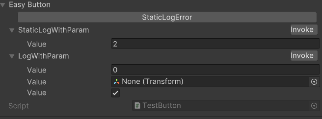
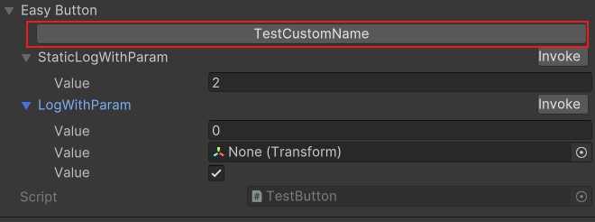

# EasyButton implemented with UIToolkit
Provide a functionality to quickly add buttons to the inspector window, mainly for testing purpose

## Installation
doesn't support upm, you can only get through git url
### git url
you need get this repo and dependencies
1. this repo: https://github.com/xiaoweitorch/EasyButton.git
2. property view: https://github.com/xiaoweitorch/LWPropertyView.git

## How to use
### Base use
with `[EasyButton]` attribute, instantly add button to inspector

support method different kinds of method

1. static
2. with params
3. with return

```c#
 using LW.Util.EasyButton; // import easybutton
 public class TestButton : MonoBehaviour
 {
    [EasyButton]
    public static void StaticLogError()
    {
        Debug.LogError($"[EasyButton]static log error");
    }

    [EasyButton]
    public static uint StaticLogWithParam(uint a = 2)
    {
        Debug.LogError($"a={a}");
        return a;
    }

    [EasyButton]
    public int LogWithParam(int a, Transform tf, bool c = true)
    {
        Debug.LogError($"a={a} transform={tf}");
        return a;
    }
 }
```


### advanced option
#### Default Value

1. you can use method default value
    ```c#
    // the default field will be: None, 2, true
    [EasyButton]
    public int LogWithParam(Transform tf, int a = 2, bool c = true)
    {
        Debug.LogError($"a={a} transform={tf}");
        return a;
    }
    ```
2. can use EasyButton default value
    when attribute default value is null, will auto use method default value
   ```c#
   // default field: None, 2, false
   [EasyButton(null, null, false, Order = 1)]
    public int LogWithParam(Transform tf, int a = 2, bool c = true)
    {
        Debug.LogError($"a={a} transform={tf}");
        return a;
    }
   ```
   the default value num must match method param count
3. can bind instance field
   by use string startWith "**.**" , will be treat like bind with instance field(even it's a static method)
   ```c#
   public class TestButton : MonoBehaviour
    {
        public int A;

        [EasyButton(".A", null, false)]
        public Transform LogWithInstanceParam(int a, Transform tf, bool c = true)
        {
            Debug.LogError($"a={a} transform={tf}");
            return transform;
        }
    }
   ```

#### Name
you can custom button name

```c#
[EasyButton(Name = "TestCustomName")]
public static void StaticLogError()
{
    Debug.LogError($"[EasyButton]static log error");
}
```



#### Order
The larger the value, the closer it is to the front

```c#
[EasyButton(Name = "TestCustomName", Order = 1)]
public static void StaticLogError()
{
    Debug.LogError($"[EasyButton]static log error");
}
```

#### DefaultExpand
only work when method have params, determines whether foldout default expand

```c#
[EasyButton(DefaultExpand = true)]
public static void StaticLogError()
{
    Debug.LogError($"[EasyButton]static log error");
}
```

#### EnableMode
have three enableMode

```c#
public enum EnableMode
{
    AlwaysEnable,
    PlayModeEnable,
    EditModeEnable,
}
```

when enable mode not match, the button will be hiden

```c#
[EasyButton(EnableMode = EnableMode.EditModeEnable)]
public static void StaticLogError()
{
    Debug.LogError($"[EasyButton]static log error");
}
```

#### PrintReturn
by default, the return value will be ignored. 

with define `PrintReturn`, return value will be printed

```
public enum PrintLevel
{
    None,
    Debug,
    Warn,
    Error,
}

[EasyButton(PrintReturn = PrintLevel.Error)]
public static void StaticLogError()
{
    Debug.LogError($"[EasyButton]static log error");
}
```

## Custom
there is a simple helper method, help add easyButton to your custom editor
```c#
ButtonViewUtil.CreateButtonsView(object obj);
```

actual blow is the magic why easybutton insert into inspector
```c#
[CustomEditor(typeof(MonoBehaviour), true)]
public class MonoBehaviourEditor : UnityEditor.Editor
{
    public override VisualElement CreateInspectorGUI()
    {
        var container = new VisualElement();
        InspectorElement.FillDefaultInspector(container, serializedObject, this);
        var buttonsView = ButtonViewUtil.CreateButtonsView(serializedObject.targetObject);
        if (buttonsView != null)
        {
            container.Insert(0, buttonsView);
        }
        return container;
    }
}
```

## Tips
1. the package only test on Unity 2022_3 & 2022_2, other version might not support, welcome to issue
2. This is an imitation of another project with the same name([EasyButtons](https://github.com/madsbangh/EasyButtons)). If you are using traditional OnGUI, you can use it.